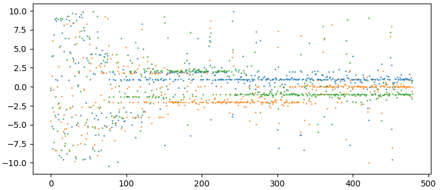

# Treibhaus

Tries to find the best model using genetic methods.

Still in a very experimental state.

**features/peculiarities:**

- Parents are selected at random, but selecting them becomes more likely when
they performed well. Children of well performed parents mutete only slightly,
those of worse performing mutate more.

- Genes of parents are combined randomly.

- When not observing improvements, will increase its search radius for
better individuals.

- Calculates the gradient between parents and their childs to improve
training in continuous domains.

- Can be multiprocessed using a 'workers' hyperparameter.

## Contributing

"TODO" markings are scattered across treibhaus.py that can be worked on.

New examples and benchmarks are also much appreciated, as well as new ideas and features.

To goal is to have something that works out of the box for *easy* problems 
with a very minimal coding effort. Other than that, it's mostly for the sake
of fun, implementing new funky features and ideas.

## Installation

```bash
git clone https://github.com/sezanzeb/Treibhaus.git
cd Treibhaus
sudo pip3 install -e .
```

```python
from treibhaus import Treibhaus
```

## Examples

See the examples folder.

- example1: rastrigin function
- example2: optimizing a neural network to match a quadratic function (does not work yet :p)
- example3: optimizes a polynomial function to match a qubic function
- example4: tests if gradient ascent in the GA (climbing to a high fitness) performs better on a very simple example (TODO: create a benchmark for vs learning_rate=0)




Finding the global minima of a 3-dimensional Rastrigin function, the closer to 0 the better. In this example, it can be very nicely seen, how some parameters gather in local minima and vanish, as other individuals find better minima for that parameter. Notably the orange cluster that exists from 100 to 350, and the green cluster between 150 and 250.

The pattern of lines from the left to right emerges, because the rastrigin function has its local minima arranged in a grid.
